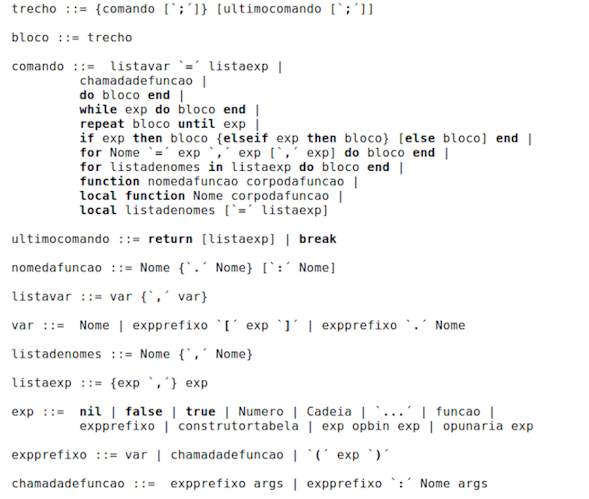
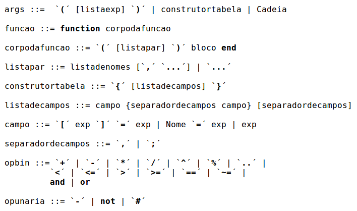
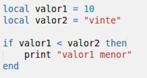
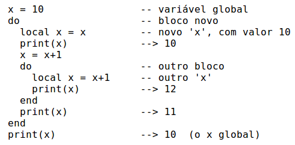
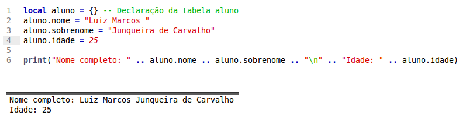
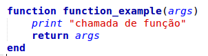
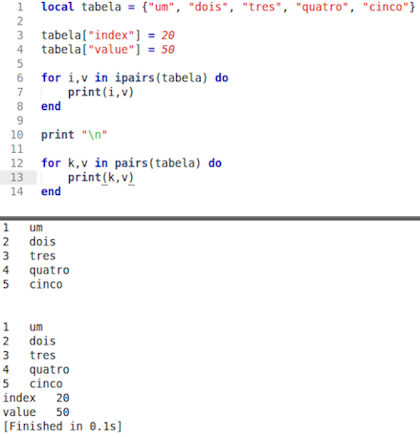

Projeto Integrador VI
================
---
Elaboração
=============

 
 
 
 
 
 
<h1>Mário Sérgio</h1>
 
 
 
 
 
 
 
<h1>Pedro Martins</h1>

---

Paradigmas de Linguagem de Programação
====================
---

Lua
====================

---

Paradigmas e Conceitos de Lua
==============

 
 

Este projeto acadêmico se refere ao desenvolvimento de um estudo e pesquisa, relativo aos paradigmas e conceitos da linguagem de programação Lua.

 

---
Roteiro
=======
- Objetivos
- Motivações
- História da Linguagem
- Ánálise Léxica e Sintática
- Semântica das variáveis
- Tipos de Dados
- Expressões
- Sentenças de Atribuição
- Estruturas de Controle
- Orientação à tabelas
- Facilidades
- Considerações Finais

---
Objetivos
=========

 

- O objetivo principal do projeto é aplicar os conhecimentos obtidos na disciplina de paradigmas de linguagem de programação à linguagem LUA.
	- Levantar os paradigmas de programação da linguagem;
	- Analisar Sintaxe e Semântica;
	- Explicar e exemplificar o funcionamento de variáveis. Tipos, sua vinculação, verificação de tipo e escopo;
	- Entender as vantagens, desvantagens e as áreas a qual LUA melhor se aplica;
	- Criar códigos para exemplificar os conceitos apresentados. 

---
Motivações
=========

- Linguagem dinâmica e de fácil entendimento;
- Única linguagem criada fora do eixo de países desenvolvidos com relevância internacional;
- Leve, com apenas 20.000 linhas de código C;
- Portável, o nicho de aplicação de Lua é muito vasto, podendo ser utilizada em várias tecnologias como:
	- Microcontroladores; 
	- Plataformas móveis;
	- Consoles de jogos;
	- Navegadores (traduzido para JavaScript);
	- Aplicações de TV digital;
	- Programas de manipulação de imagens.
---
Algumas aplicações
=========

---
Jogos
=========

---
Simuladores de Engenharia
============

 

---
História
=======
- A construção da linguagem veio de um projeto entre a PETROBRAS e a PUC-RIO, a fim de produzir um programa de interfaces gráficas para várias aplicações.

- Surgiram então duas linhas de pesquisa e desenvolvimento.
	- Logo surgiu o DEL - Linguagem para Especificação de Diálogos;
	- ‘SOL’ - Simple Object Language, uma linguagem para descrição de objetos, inspirada no bibTex e em tabelas de banco de dados.

---
História
=======

- No entanto, DEL e SOL tinha várias limitações;
	- As propostas de solução era formular uma nova linguagem de configuração genérica com as seguintes características:
		- Facilmente acoplável;
		- Portável
		- Simples e de sintaxe fácil
	- Envolvidos: Roberto Ierusalimschy, Luiz Henrique de Figueiredo e Waldemar Celes;

---
História
=======

O resultado desse projeto foi dado o nome LUA, como um contraste da antiga SOL.

---

Aspectos Léxicos e Sintáticos
=============

---

Construções léxicas
=======

 
Os nomes da linguagem podem ser cadeias de letras, dígitos e sublinhados.

Sendo que, os nomes não começam com dígitos

Lua é uma linguagem que diferencia letras minúsculas de maiúsculas

 

	!lua
		 -- EXEMPLOS DE NOMES
		 local tabela = {}
		 
		 tabela.variavel = "caracteres"
		 
		 tabela.VARIAVEL = "maiúsculas"
		 
		 tabela._variavel = "sublinhado"
		 
		 tabela.variavel20 = "dígitos"

---
Sintaxe
========

---
BNF
===

---

---
Variáveis
=========

---
Lua
===
	!lua
		local x = 1 -- VARIÁVEL LOCAL
		Y = 10 -- VARIÁVEL GLOBAL

		tabela =  {} -- DECLARAÇÃO DE TABELA GLOBAL
		tabela["primeiro_indice"] = 100 -- VARIÁVEL DE TABELA

- Em Lua existem três tipos de variáveis, sendo elas as seguintes

	- Variáveis locais
	- Variáveis globais
	- Variáveis de tabelas

- A diferença entre variáveis locais e globais é o uso da palavra reservada ‘local’, antes do nome da variável

---
Vinculação
==========

---
Lua
===
- Lua é uma linguagem dinamicamente tipada;
- A linguagem trabalha com vinculação dinâmica de tipos;

 

- Não existem definições de tipos na linguagem;	
- Trás muita flexibilidade para a programação.

 

- O tempo de vida das variáveis é definido pelo fato de ela se global ou local;

---
Verificação de Tipo
============

---
Lua
===
- A verificação de tipos em Lua é feita em tempo de execução pelo interpretador Lua;

 

 

---
Escopo
======

---
Lua
===
- Lua é uma linguagem com escopo léxico; 
- Baseia-se na sequência de chamadas de subprogramas;
- O escopo pode ser determinado em tempo de execução;
- Variáveis locais podem ser livremente acessadas por funções definidas dentro do seu escopo ou bloco;

---
Tipos de Dados
===

---
Lua
===
- Existem oito tipos de dados básicos em Lua:
	- nil
	- boolean
	- number
	- string
	- thread
	- **function**
	- **userdata**
	- **table**

---
Expressões
===

---
Operadores Aritméticos
===

Lua fornece os principais elementos de aritméticos binários como:

- adição (+)
- subtração (-)
- multiplicação (*)
- divisão (/)
- módulo (%)
- exponenciação (ˆ)

Além do aperador unário de negação (-).

---
Operadores Relacionais
===

- Um operador relacional compara os valores de dois operandos;
- O valor da expressão relacional é sempre booleano, **true** ou **false**;
- Abaixo estão listados os operadores relacionais:
	- ==
	- ~=
	- <
	- \>
	- <=
	- \>=
- Objetos (table, userdata, thread e function) são comparados por referência.

---
Operadores Lógicos
===

- Os operadores lógicos em Lua são **and**, **or** e **not**;
- O operador de negação **not** sempre retorna **false** ou **true**;
- O operador de conjunção **and** retorna seu primeiro argumento, se este valor é **false** ou **nil**, caso contrário o operador retorna o segundo argumento;
- O operador **or** retorna seu primeiro argumento se o valor deste é diferente de nil e de false, caso contrário, retorna o seu segundo argumento;
	
	- **false** **and** **nil** -> **false**
	- 20 **and** 30 -> 30
	- 10 **or** 20 -> 10
	- **nil** **or** “a” -> “a”
	- **false** **or** **nil** -> **nil**

---
Concatenação
===
O operador de concatenação de cadeias de caracteres em Lua é denotado por dois pontos (..).

Se ambos os operandos são cadeias de caracteres ou números, então eles são
convertidos para cadeias de caracteres.

 
 

---
Operador de Comprimento
===
O operador de comprimento é denotado pelo operador unário #.

- O comprimento de uma cadeia de caracteres, por exemplo, é o seu número de bytes;
- O comprimento de uma tabela t é definido como qualquer índice inteiro n;
	- Para um array comum, com todos os valores diferentes de nil indo de 1 até n, o seu comprimento é exatamente n;
	- O operador **#** somente retorna o tamanho de uma tabela, caso seus índices sejam números inteiros;
	- Se o array possuir intervalos descontínuos, então #t pode ser qualquer um dos índices que imediatamente precedem um valor nil.

---
Precedência
===
- Como padrão, não existe a necessidade de usar parênteses para mudar as precedências de uma expressão;
- A precedência de operadores segue a seguinte ordem, do menor ao maior:
 	- or
    - and
    - <     >     <=    >=    ~=    ==
    - ..
    - \+     \-
    - \*     /     %
    - not   #     - (unary)
    - ^
- Como padrão, não existe a necessidade de usar parênteses para mudar as precedências de uma expressão.

---
Definições e Chamadas de Função
===
- Segue a seguir a sintaxe para a definição de uma função:
- funcao ::= **function** corpodafuncao funcao ::= ( [listapar] ) bloco **end**;
- Em Lua o comando **function** f () corpo **end** é traduzido para f = **function** () corpo **end**;

- Uma chamada de funçao da forma return é denominada de chamada final;
- não há limite no número de chamadas finais aninhadas que um programa pode executar.

---
Sentenças de Atribuição
===

---
Lua
===
- Lua permite atribuições simples e múltiplas;
- A sintaxe para a atribuição define uma lista de variáveis no lado esquerdo e uma lista de expressões do lado direito;
	- **Comando de Atribuição -> Lista de Variáveis = Lista de Expressões**
- Se houver mais valores do que variáveis, esses valores são descartados;
- Se houver menos valores a lista é completada com valores nulos (nil).
- É importante lembrar que Lua não permite atribuições unárias como C, C++ ou Java. Como ++ ou --.

---
Estruturas de Controle
===

---
Lua
===
- Em Lua as estruturas de controle **if**, **while** e **repeat** possuem o significado usual e a sintaxe familiar;
	- comando ::= **while** exp **do** bloco **end**
	- comando ::= **repeat** bloco **until** exp
	- comando ::= **if** exp **then** bloco **elseif** exp **then** bloco [**else** bloco] **end**

 
 

- O comando **break** é usado para terminar a execução de um laço **while**, **repeat** ou **for**;
- Os comandos **return** e **break** somente podem ser escritos como o último comando de um bloco;

---
O comando *for*
===
- Lua possui duas variações do comando **for**, sendo uma numérica e outra genérica;
- O for em Lua pode iterar especificamente sobre os elementos de uma tabela Lua de duas formas distintas, utilizando o modelo genérico.

---
Orientação à Tabelas
===

---
Abstração de dados
===

---
Manipulação de Tabelas
===

---
Metatabelas
===

---
Facilidades
===

---
Tratamento de Erros
===

---
Ambientes
===

---
Coleta de Lixo
===

---
Considerações Finais
===

- Pontos Positivos
	- Proposta de projeto proposta;
	- Foi extraído da linguagem Lua os seus principais paradigmas e conceitos;
	- Aquisição de maturidade para saber quais são os melhores campos de problemas e projetos que Lua pode ser inserida.
- Pontos Negativos
	- Não foi possível mapear totalmente os recursos a linguagem;
	- Dificuldade no acesso às informações do código Lua.
- Propostas de continuidade
	- Estudo voltados ao interpretador Lua/C;
	- Lua aplicada à Jogos.