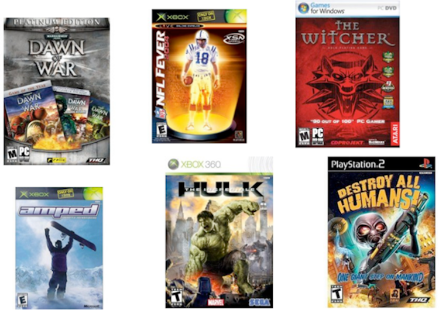
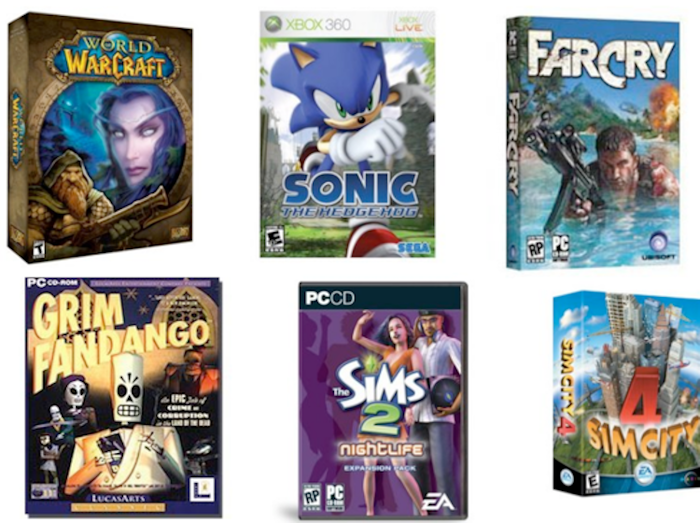
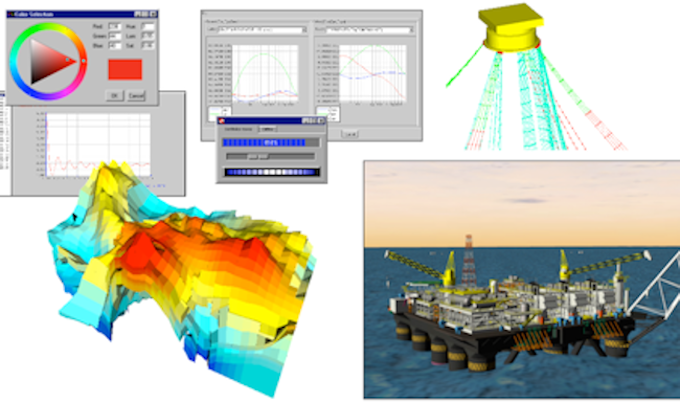
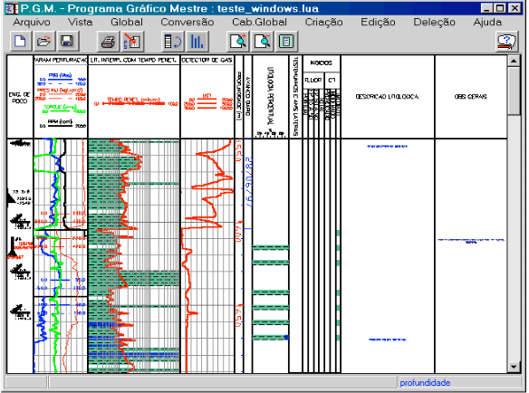
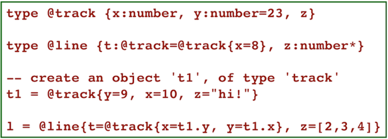
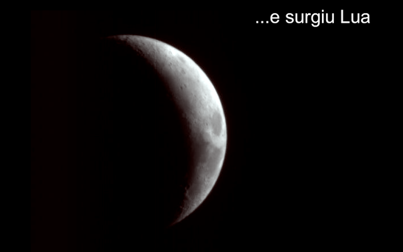

Projeto Integrador VI
================
---

*Mário Sérgio*

*Pedro Martins*

---

Paradigmas de Linguagem de Programação
====================
---

Lua
====================

---

Paradigmas e Conceitos de Lua
==============

 
 

Este projeto acadêmico se refere ao desenvolvimento de um estudo e pesquisa, relativo aos paradigmas e conceitos da linguagem de programação Lua.

 

---
Roteiro
=======

 

- Objetivos
- Motivações
- História da Linguagem
- Ánálise Léxica e Sintática
- Semântica das variáveis
- 
- 
- 
- Considerações Finais

---
Objetivos
=========

 

- O objetivo principal do projeto é aplicar os conhecimentos obtidos na disciplina de paradigmas de linguagem de programação à linguagem LUA.
	- Levantar os paradigmas de programação da linguagem;
	- Analisar Sintaxe e Semântica;
	- Explicar e exemplificar o funcionamento de variáveis. Tipos, sua vinculação, verificação de tipo e escopo;
	- Entender as vantagens, desvantagens e as áreas a qual LUA melhor se aplica;
	- Criar códigos para exemplificar os conceitos apresentados. 

---
Motivações
=========

- Linguagem dinâmica e de fácil entendimento;
- Única linguagem criada fora do eixo de países desenvolvidos com relevância internacional;
- Leve, com apenas 20.000 linhas de código C;
- Portável, o nicho de aplicação de Lua é muito vasto, podendo ser utilizada em várias tecnologias como:
	- Microcontroladores; 
	- Plataformas móveis;
	- Consoles de jogos;
	- Navegadores (traduzido para JavaScript);
	- Aplicações de TV digital;
	- Programas de manipulação de imagens.
---
Algumas aplicações
=========

---
Jogos
=========

---
Jogos
=========

---
Simuladores de Engenharia
============

 

---
História
=======

- A construção da linguagem veio de um projeto entre a PETROBRAS e a PUC-RIO, a fim de produzir um programa de interfaces gráficas para várias aplicações.

---
História
=======
- Surgiram então duas linhas de pesquisa e desenvolvimento.
	- Logo surgiu o DEL - Linguagem para Especificação de Diálogos;
	- ‘SOL’ - Simple Object Language, uma linguagem para descrição de objetos,inspirada no bibTex e em tabelas de banco de dados.

---
História
=======

- No entanto, DEL e SOL tinha várias limitações;
	- As propostas de solução era formular uma nova linguagem de configuração genérica com as seguintes características:
		- Facilmente acoplável;
		- Portável
		- Simples e de sintaxe fácil
	- Envolvidos: Roberto Ierusalimschy, Luiz Henrique de Figueiredo e Waldemar Celes;

---
História
=======

O resultado desse projeto foi dado o nome LUA, como um contraste da antiga SOL.

---

Lua
====
	!lua
		variavel = {}
		local var = {"um","dois"}
# Presenter Notes

Hello from presenter notes

---
TESTES
========

jfsdkfnlksdf
--------------
- vvkdjf
- lsfds
	- kdjfsoa
---
